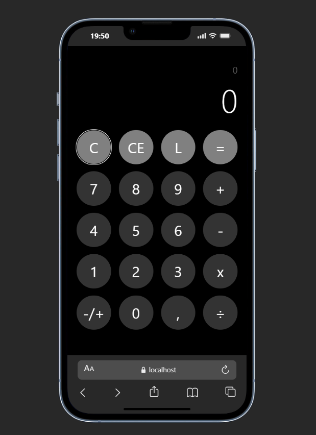

Requisitos:

-- Realizar operações de Soma, Subtração, Multiplicação e Divisão; 
 
-- Ter a capacidade de deletar todo o calculo (CE);
 
-- Ter a capacidade de limpar somente o número atual no display (C);
 
-- Ter a capacidade de deletar somente alguns números (L);
 
-- Ter a capacidade de adicionar números positivos e negativos aos calculos;
 
-- Ter a capacidade de adicionar números com casas decimais aos calculos;
 
-- Ser possível fazer várias operações em sequência sem reiniciar o resultado (2+2+2 por exemplo).
 

Protótipo: 

